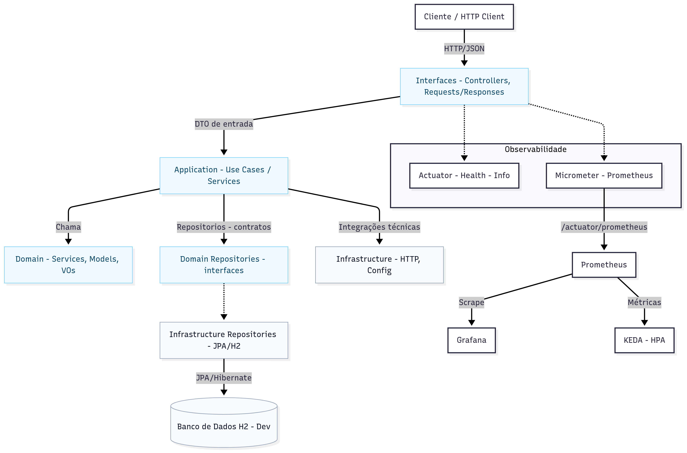

## Visão Geral

API RESTful em Spring Boot para consulta de CEP na VIACEP para validar, fazer a consulta em uma tabela de frete e exibir pro cliente final o resultado da melhor escolha. (Domain/Application/Infrastructure/Interfaces).  
A aplicação expõe métricas via Micrometer/Prometheus e endpoints de saúde (Actuator), permitindo observabilidade e escalabilidade automática em Kubernetes (EKS).


Principais objetivos:
- Expor endpoints REST.
- Encapsular regras de negócio na camada de domínio.
- Orquestrar casos de uso na camada de aplicação (services de aplicação)_._
- Integrar com infraestrutura (banco H2 para desenvolvimento).
- Expor métricas em /actuator/prometheus para autoscaling baseado em métricas.

## Pré-requisitos

- Java 21 (JDK 21)
- Maven 3.9+
- Kubernetes/EKS (opcional, para deploy)
- Helm (opcional, para instalar Prometheus/Grafana/KEDA)
- cURL ou HTTP client para testar endpoints

# Diagrama API


## Endpoins criados

1. POST /shipping — Calcular frete

   - Descrição: Calcula o valor e o prazo do frete com base em origem, destino, dimensões/peso e opção de envio.
   - Requisição:
     - URL: http://localhost:8080/api/shipping
     - Método: POST
     - Headers: Content-Type: application/json; Accept: application/json

   - Exemplo (cURL):
     ```bash
     curl -i -X POST "http://localhost:8080/api/shipping" \
       -H "Content-Type: application/json" \
       -H "Accept: application/json" \
       --data-raw '{
         "origin": { "postalCode": "01001000" },
         "destination": { "postalCode": "01310931" },
         "options": [ { "code": "convencional" } ],
         "dimensions": { "width": 10.0, "height": 5.0, "length": 20.0, "weight": 2.5 }
       }'
     ```

   - Respostas:
     - 200 OK
       - Corpo (exemplo ilustrativo):
         ```json
         {"origin":{"postalCode":"01001000"},"destination":{"postalCode":"01310931"},"options":[{"code":"convencional"}],"dimensions":{"width":10,"height":5,"length":20,"weight":2.5},"delivery_options":[{"name":"convencional","deadeline":5,"price":15}]}
         ```
     - 422 Unprocessable Entity
       - Corpo:
         ```json
         { "message": "No freight rate found for the given origin and destination ZIP codes" }
         ```
     - 500 Internal Server Error
       - Corpo (genérico):
         ```json
         { "message": "Internal server error" }
         ```

2. GET /shipping/options — Listar opções de envio, para ser escalável opções de envio.
   curl -i -X GET "http://localhost:8080/api/shipping/options" 
 ```json 
[
  {
    "code": "all"
  },
  {
    "code": "convencional"
  },
  {
    "code": "express"
  }
]
```

3. GET /shipping/quotes — Listar cotações que foram feitas no cache, com status os dados e responses.
   curl -i -X GET "http://localhost:8080/api/shipping/quotes"
```json
[{"id":1,"originCep":"01001000","destinationCep":"01310931","width":10,"height":5,"length":20,"weight":2.5,"selectedServices":"convencional","createdAt":"2025-08-20T11:27:44.511877-03:00","success":false,"errorMessage":"No freight rate found for the given origin and destination ZIP codes"},{"id":2,"originCep":"01001000","destinationCep":"01310931","width":10,"height":5,"length":20,"weight":2.5,"selectedServices":"convencional","createdAt":"2025-08-20T11:29:45.752847-03:00","success":false,"errorMessage":"Failed to validate both origin and destination ZIP codes"}]
``` 


## Tecnologias e bibliotecas

- Spring Boot 3.5.x
  - spring-boot-starter-web (REST)
  - spring-boot-starter-data-jpa (JPA/Hibernate)
  - spring-boot-starter-actuator (health, info, métricas)
  - spring-boot-starter-validation (Bean Validation)
- Micrometer + Prometheus (micrometer-registry-prometheus)
- Banco em dev: H2
- Lombok (boilerplate reduction)
- Testes: spring-boot-starter-test (JUnit 5, Mockito, AssertJ)

## Como executar localmente

1) Build
- mvn clean package

2) Executar
- mvn spring-boot:run
- ou java -jar target/demo-0.0.1-SNAPSHOT.jar

3) Endpoints úteis
- Saúde: GET http://localhost:8080/actuator/health
- Métricas (Prometheus): GET http://localhost:8080/actuator/prometheus
- Info: GET http://localhost:8080/actuator/info


## Arquitetura do código:




## Débitos técnicos e próximos passos

- Observabilidade e desempenho
    - [ ] Testes de carga/estresse para validar autoscaling (KEDA/HPA), latência e throughput.
    - [ ] Metas de SLO/SLI e métricas de negócio (cotações OK, 4xx/5xx, p95).

- Segurança
    - [ ] Validação robusta contra payloads maliciosos (limites de tamanho, formatos, sanitização).
    - [ ] Rate limiting e proteção contra brute force.
    - [ ] Configuração de CORS e cabeçalhos de segurança.

- Arquitetura e qualidade
    - [ ] Paginação e ordenação nas listagens (ex.: page, size, sort).
    - [ ] Padronização de respostas de erro (envelope consistente).
    - [ ] Testes automatizados (unidade, integração e contrato).

- Operação e ambientes
    - [ ] Separação de ambientes: dev, test e prod (profiles e propriedades dedicadas).
    - [ ] Externalização e rotação de segredos com AWS Secrets Manager.
    - [ ] Pipeline de CI (GitHub Actions) com build, testes, análise estática e artefatos.
